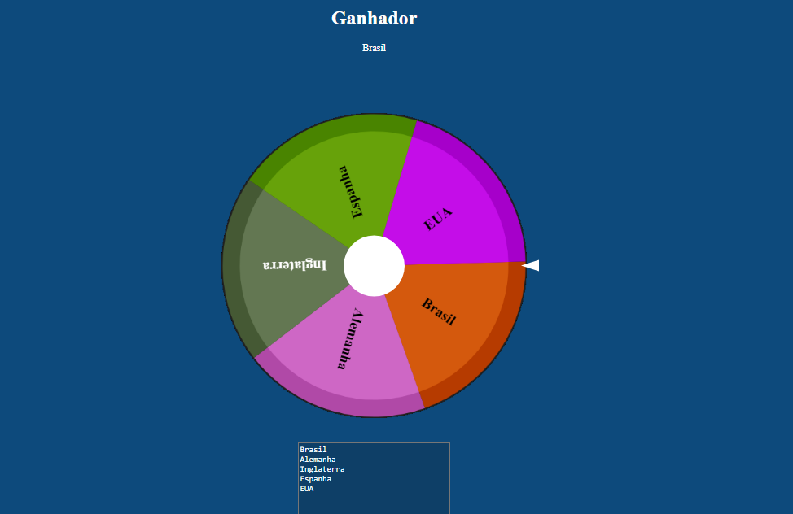

# Roleta de Sorteio
Este projeto é uma aplicação web interativa que permite criar uma roleta customizada, que gira para selecionar aleatoriamente um dos itens inseridos pelo usuário em uma área de texto. É ideal para sorteios e jogos interativos.
## Funcionalidades
- Roleta Personalizável: O usuário pode inserir diversos itens em uma área de texto. Cada item será representado como uma seção da roleta.
- Giro Aleatório: A roleta pode ser girada, simulando um sorteio aleatório entre os itens inseridos.
- Efeitos de Desaceleração: O giro da roleta desacelera suavemente até parar, e o item vencedor é exibido na tela.

## Como Usar
- Clone ou faça o download dos arquivos do projeto.
- Abra o arquivo index.html em seu navegador.
- Insira os itens para o sorteio na área de texto.
- Clique no círculo central para iniciar o giro da roleta.
- O item vencedor será exibido abaixo do título "Ganhador".

## Ex:

